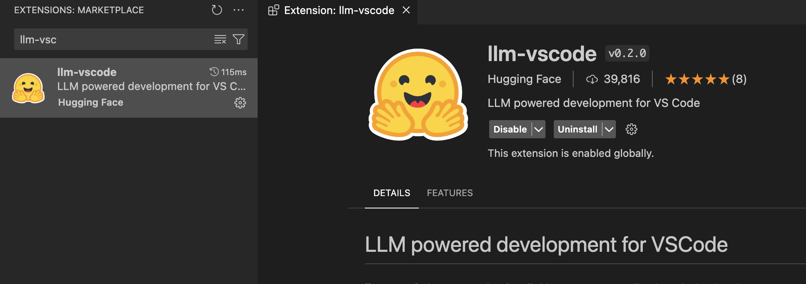
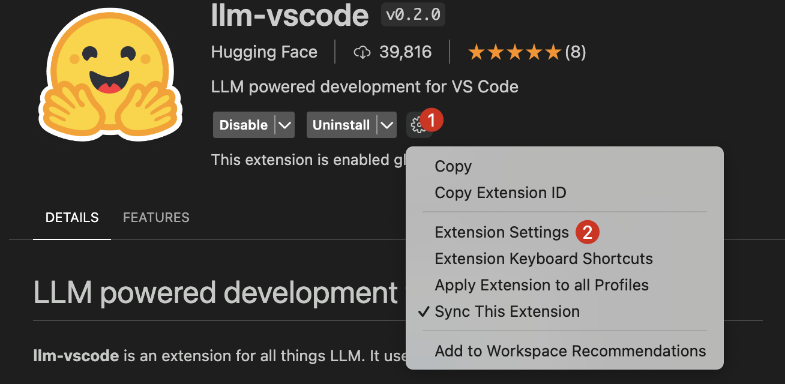
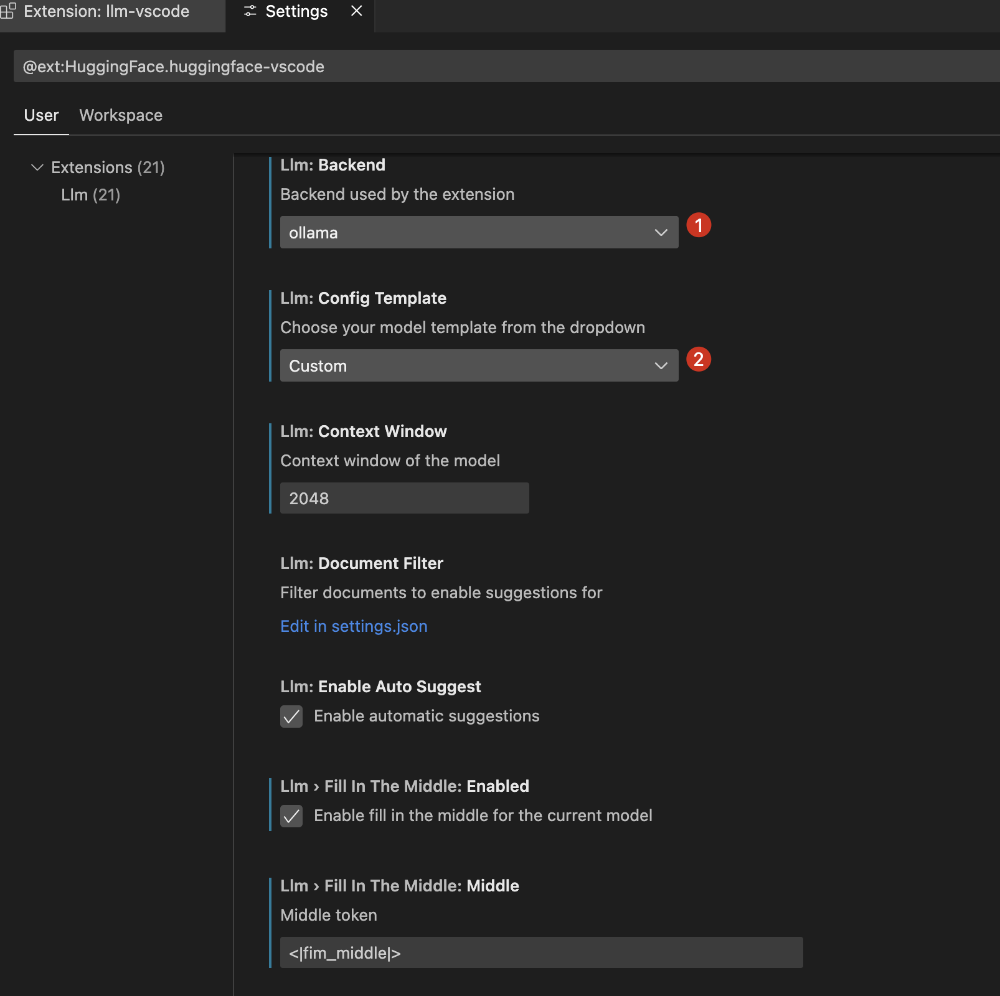
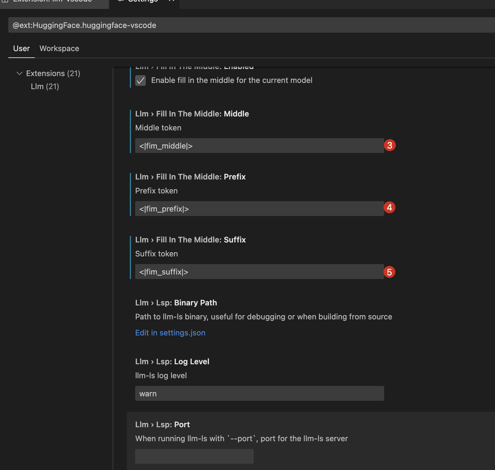
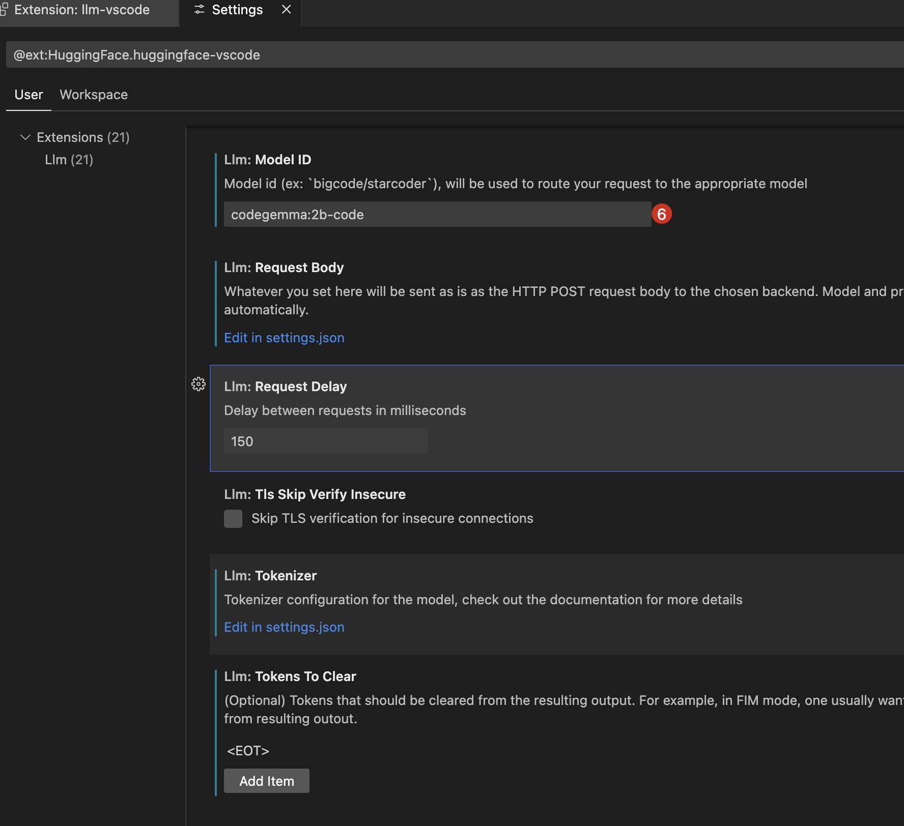
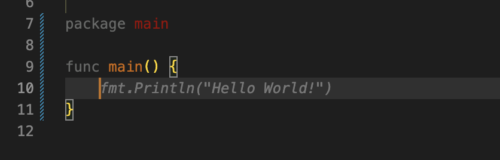

# OpenCopilot
🥳 OpenCopilot is an open source AI pair programmer. Inspired by the [GitHub Copilot](https://github.com/features/copilot). 
And I decide to use the [CodeGemma-7b](https://huggingface.co/TechxGenus/CodeGemma-7b) or some similar SoTA code completion model to power it.

Feel free to join me :)

## Quick Start
1. Install the [llm-vscode](https://marketplace.visualstudio.com/items?itemName=HuggingFace.huggingface-vscode) extension in VSCode.

2. Configurate the extension settings in VSCode.

3. Try it!

## Extensions
There are some open source extensions to IDE which can help you to use this AI pair programmer:
- [llm-vscode](https://github.com/huggingface/llm-vscode)

## References
- [Personal Copilot: Train Your Own Coding Assistant](https://huggingface.co/blog/personal-copilot)
- [Code Llama: Open Foundation Models for Code](https://arxiv.org/pdf/2308.12950.pdf)
- [QLoRA: Efficient Finetuning of Quantized LLMs](https://arxiv.org/abs/2305.14314)
- [Efficient Training of Language Models to Fill in the Middle](https://arxiv.org/pdf/2207.14255.pdf)